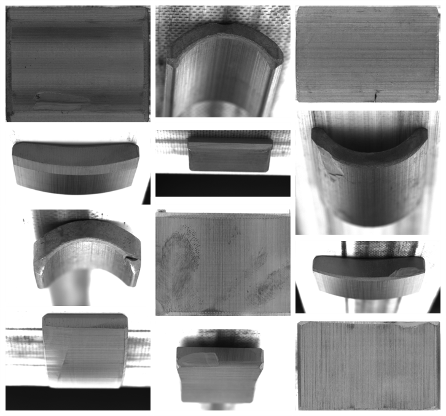
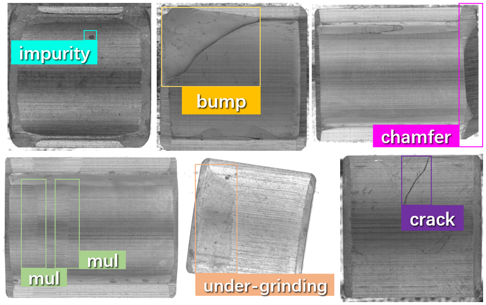

# Magnetic-Tile-Surface-Defect-Detection-Dataset (MTS3D)

This dataset is collected by Precision Measurement &amp; Vision AI Lab. The magnetic tile dataset was collected from four actual manufacturing production lines.

Samples sourced from different manufacturers exhibit variations in terms of the photography environment (lighting, contrast), shooting angles (background), and sample arrangement (texture direction). Figure below visually demonstrates the discrepancies observed among samples originating from various sources.



## Cleaning Strategy

During the dataset construction phase, we employed only the most fundamental cleaning strategy, primarily focusing on class filtering, to closely mimic the situations encountered in real industrial production settings. Through this strategy, our aim was to capture and replicate the challenges encountered in actual production scenarios. Our dataset offers significant advantages over currently available publicly accessible datasets in terms of quantity, quality, diversity, and fidelity to real-world scenarios in the industrial domain. By conducting experiments and evaluations using our dataset, we can comprehensively validate the performance of our methods in the task of industrial defect detection. Additionally, the inclusion of data that is not entirely “perfect” adds to the challenge of our task.

## Defect Types

Our dataset comprises six categories of surface defects:

1. impurity,
2. bump,
3. chamfer,
4. multifaceted,
5. under-grinding,
6. crack.



## Citation

> The link will be updated shortly.

The MTS3D can be downloaded from [here](TODO:), and it is for the paper:

[The paper link](TODO:)

Please cite the paper if you use this dataset:

```
The Bibtex of the paper
```

<!-- ## Contact

This dataset is for research use only. If you have any problem about this work or dataset, please contact with Prof. Xinghui at li.xinghui@sz.tsinghua.edu.cn. -->
